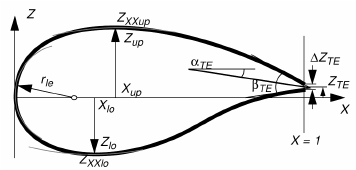

# PARSEC Definition
The following image explain the meaning of the parameters using to define the PARSEC airfoil.

To compare the variables

[picture to be revised]

| Description                 | Symbol(Picture)| Variable (Code) |
|-----------------------------|----------------|-----------------|
| Leading Edge Radius         | \(R_{LE}\)           | `rle`|
| Upper Crest Abscissa        | \(X_{UP}\)           | `x_suc`|
| Upper Crest Ordinate        | \(Z_{UP}\)           | `y_suc`|
| Upper Crest Curvature       | \(Z_{XXUP}\)         | `d2ydx2_suc`|
| Lower Crest Abscissa        | \(X_{LO}\)           | `x_pre`   |
| Lower Crest Ordinate        | \(Z_{LO}\)           | `y_pre`   |
| Lower Crest Curvature       | \(Z_{XXLO}\)         | `d2ydx2_pre`       |
| Trailing Edge Ordinate      | \(Z_{TE}\)           |(`yte upper` + `yte lower`)/2|
| Trailing Edge Thickness     | \(ΔZ_{TE}\)          |`yte upper` - `yte lower`|
| Trailing Edge Direction     | \(α_{TE}\)           |`th_suc`|
| Trailing Edge Wedge Angle   | \(β_{TE}\)           |`th_suc` + `th_pre`|


```python
Geometry_data = Geometry()

# Geometry to analyze
''' Could be airfoil or wing
        Airfoils can be parametrically defined using the PARSEC methods
        Wings are defined only using the existing CAD file and work either for
        straight tapered wings with or without the kink'''

Geometry_data.type = 'airfoil'

# Reference values
Geometry_data.reference_values = {
        "Area"   : 2.62,
        "Length" : 2.62,
        "Depth"  : 1,
        "Point"  : [0.25*2.62,0,0]              # reference point about which the moment is taken
    }

segment = Segment()
segment.tag                = 'section_1'
segment.spanwise_location  = 0 
segment.chord              = 2.62
segment.Airfoil.files      = {
        "upper" : "main_airfoil_upper_1.dat",
        "lower" : "main_airfoil_lower_1.dat"
    }
segment.Airfoil.PARSEC     = {
                                    "rle"        : 0.0084,                      # Main airfoil LE radius
                                    "x_pre"      : 0.458080577545180,           # x-location of the crest on the pressure side
                                    "y_pre"      : -0.04553160030118,           # y-location of the crest on the pressure side  
                                    "d2ydx2_pre" : 0.554845554794938,           # curvature of the crest on the pressure side  
                                    "th_pre"     : -9.649803736,                # trailing edge angle on the pressure side [deg]
                                    "x_suc"      : 0.46036604,                  # x-location of the crest on the suction side 
                                    "y_suc"      : 0.06302395539,               # y-location of the crest on the suction side
                                    "d2ydx2_suc" : -0.361421420,                # curvature of the crest on the suction side
                                    "th_suc"     : -12.391677695858,            # trailing edge angle on the suction side [deg]
                                    "yte upper" : 0.002,
                                    "yte lower" : -0.002
    }
Geometry_data.Segments.append(segment)

segment.plot_airfoil = True
```