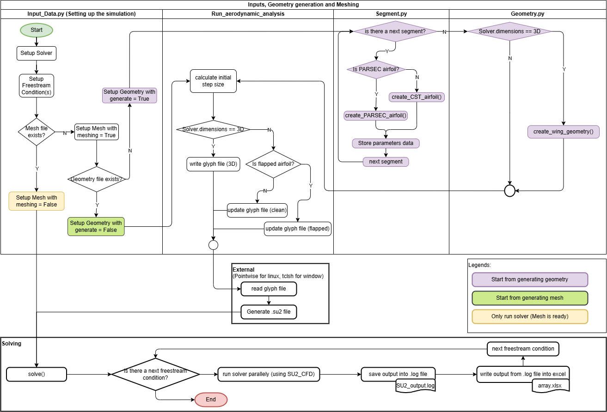

# Overview

The picture below is the high level flowchart of the code explaining the main idea. There are 3 legends included in this diagram:

1. Case starting from geometry generation
2. Case starting from meshing (geometry is ready)
3. Case starting from solving (geometry and mesh is ready)  

