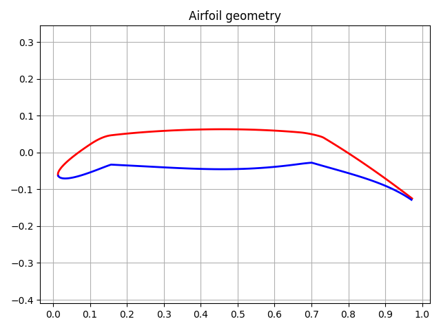
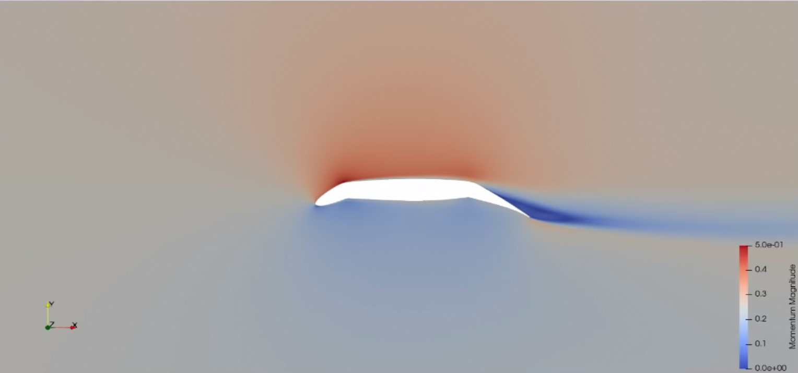

# Airfoil including trailing edge device and leading edge device

Clean Airfoil Full test case is the simulation of the air flow through the clean airfoil (without flaps, just airfoil). In this case, PARSEC airfoil parameterized method is used to create the airfoil geometry.



**Steps:**

1. Setting the input for the simulation
    * The geometry is defined using PARSEC
2. In function `run_aerodynamic_analysis`, 
    1. Generate the file for geometry and mesh the geometry
    2. Solve using SU2
    3. Read results from the runtime log and save them as csv and vtu
3. Visualize the result using Paraview

## Inputs

```python
import os
import numpy as np
from Core.Data                          import Data
from Components.Solver                  import Solver
from Components.Geometry                import Geometry
from Components.Geometry.Wing.Segment   import Segment
from Components.Mesh                    import Mesh

from Run_aerodynamic_analysis import run_aerodynamic_analysis


def Input_data():

    working_dir = r"/home/doktorand/Software/PyAeroSweep-Stan-V3/PyAeroSweep/Test_Cases/LE_TE_flaps" 

# ------------------------------- SOLVER SETTINGS ----------------------------------------------------------- #
#

    Solver_settings = Solver()

    Solver_settings.working_dir = working_dir

    Solver_settings.name = 'SU2'                 # SU2 or Fluent

    # Solver dimensions
    # 2d   or 3d        for SU2 
    Solver_settings.dimensions = '2d'            

    # Only available for SU2 in 3D
    # defines half od the shape or a full shape analysis (Only symmetric works for now)
    Solver_settings.symmetric = True             

    # SST or SA for SU2
    Solver_settings.turbulence_model = 'SST'

    # Number of processors
    Solver_settings.processors = 4

    # Cauchy convergence criteria
    # Could be either LIFT or DRAG
    Solver_settings.monitor          = "LIFT"
    Solver_settings.tolerance        = 5e-7      
    Solver_settings.max_iterations   = 100
    Solver_settings.save_frequency   = 100

    # Warm start
    # YES or NO
    Solver_settings.warmstart = 'YES'

    # SU2 reference config file name which will be updated
    Solver_settings.config_file = 'Run_airfoil_template.cfg'


# ------------------------------- FREESTREAM SETTINGS ------------------------------------------------------- #
#
    Freestream = Data()
    Freestream.Mach             = np.array([0.21,0.25])
    Freestream.Altitude         = np.array([0,2000])                 # in meters
    Freestream.Angle_of_attack  = np.array([0.0,3.0,5.0])               # in degrees


# ------------------------------- GEOMETRY SETTINGS --------------------------------------------------------- #
#
    Geometry_data = Geometry()

    # Geometry to analyze
    ''' Could be airfoil or wing
        Airfoils can be parametrically defined using the PARSEC methods
        Wings are defined only using the existing CAD file and work either for
        straight tapered wings with or without the kink'''

    Geometry_data.type = 'airfoil'

    # Reference values
    Geometry_data.reference_values = {
        "Area"   : 2.62,
        "Length" : 2.62,
        "Depth"  : 1,
        "Point"  : [0.25*2.62,0,0]              # reference point about which the moment is taken
    }

    segment = Segment()
    segment.tag                = 'section_1'
    segment.spanwise_location  = 0 
    segment.chord              = 2.62
    segment.Airfoil.files      = {
        "upper" : "main_airfoil_upper_1.dat",
        "lower" : "main_airfoil_lower_1.dat"
    }
    segment.Airfoil.PARSEC     = {
                                    "rle"        : 0.0084,                      # Main airfoil LE radius
                                    "x_pre"      : 0.458080577545180,           # x-location of the crest on the pressure side
                                    "y_pre"      : -0.04553160030118,           # y-location of the crest on the pressure side  
                                    "d2ydx2_pre" : 0.554845554794938,           # curvature of the crest on the pressure side  
                                    "th_pre"     : -9.649803736,                # trailing edge angle on the pressure side [deg]
                                    "x_suc"      : 0.46036604,                  # x-location of the crest on the suction side 
                                    "y_suc"      : 0.06302395539,               # y-location of the crest on the suction side
                                    "d2ydx2_suc" : -0.361421420,                # curvature of the crest on the suction side
                                    "th_suc"     : -12.391677695858,            # trailing edge angle on the suction side [deg]
                                    "yte upper"  : 0.002,
                                    "yte lower"  : -0.002
    }

    segment.TrailingEdgeDevice.type   = 'Plain'
    segment.TrailingEdgeDevice.PARSEC = {
        "delta_f"    : 25,              # flap deflection [deg]
        "cf_c"       : 0.7,            # flap chord ratio
        "d_cf_up"    : 0.03,            # flap offset from the hinge on the upper surface 
        "d_cf_low"   : 0.03,            # shroud lip extent ratio wrt the flap  
        "w_con_seal" : 0.5              # conical parameter for the flap seal
    } 

    segment.LeadingEdgeDevice.type   = 'Droop'
    segment.LeadingEdgeDevice.PARSEC = {
        "delta_s"    : 25,              # droop nose deflection [deg]
        "cs_c"       : 0.15,             # droop nose chord ratio
        "d_cs_up"    : 0.03,            # droop nose offset from the hinge on the upper surface 
        "d_cs_low"   : 0.03,            # shroud lip extent ratio wrt the flap  
        "w_con_seal" : 1.0              # conical parameter for the droop nose seal
    } 

    segment.plot_airfoil = True

    Geometry_data.Segments.append(segment)


# ------------------------------- MESH SETTINGS ---------------------------------------------------------------- #
#

    Mesh_data = Mesh()

    # Flag to mesh the shape or not
    Mesh_data.meshing    = True

    # Mesh type
    Mesh_data.structured = True

    # Defined the OS in which Pointwise is used
    # WINDOWS or Linux
    Mesh_data.operating_system = 'Linux'

    # Pointwise tclsh directory used in Windows
    Mesh_data.tclsh_directory =  r"/home/doktorand/Fidelity/Pointwise/Pointwise2022.1" 

    # Desired Y+ value
    Mesh_data.Yplus = 1.0

    # Define the Glyph template to use for meshing
    Mesh_data.glyph_file = "mesh_clean_airfoil_SU2.glf"

    # Mesh filename for either the newly generated mesh or an eisting mesh
    Mesh_data.filename = 'su2meshEx.su2'

    # Define far-field 
    Mesh_data.far_field = 100 * Geometry_data.reference_values["Length"]


    Mesh_data.airfoil_mesh_settings = {
        "LE_spacing"             : 0.001,                       # Airfoil leading edge spacing
        "TE_spacing"             : 0.0005,                      # Airfoil trailing edge spacing
        "flap_cluster"           : 0.005,
        "connector dimensions"   : [200, 200, 8],     #         "connector_dimensions": [200, 120, 150, 150, 70, 25, 8, 8],
        "number of normal cells" : 230
    }


# ----------------------------------------------------------------------------------------------------------------------------- #
#
    # Pack all inputs
    Input = Data()
    Input.Solver        = Solver_settings
    Input.Freestream    = Freestream
    Input.Geometry      = Geometry_data
    Input.Mesh          = Mesh_data


    return Input


if __name__ == '__main__':

    Input = Input_data()
    run_aerodynamic_analysis(Input)
```

## Result

The magnitude of momentum at altitude 2000 m, speed = 0.25 Mach and angle of attack 3 degree.
