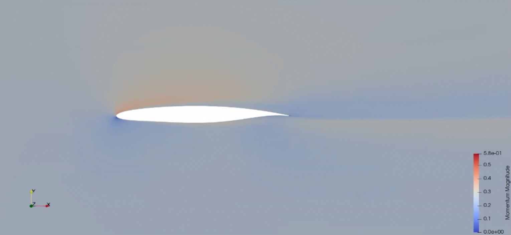

# Only RANS (only solve)

In the case mesh and run, we already have the existing geometry and its mesh, then we only start from the solving part. Therefore, the mesh file (.su2) is neccessary to run the case. 

**Steps:**

1. Setting the input for the simulation
    * Using existing geometry and mesh 
2. In function `run_aerodynamic_analysis`, 
    1. Solve using SU2
    2. Read results from the runtime log and save them as csv and vtu
3. Visualize the result using Paraview

## Inputs

```python
import numpy as np
from Core.Data                          import Data
from Components.Solver                  import Solver
from Components.Geometry                import Geometry
from Components.Geometry.Wing.Segment   import Segment
from Components.Mesh                    import Mesh

from Run_aerodynamic_analysis import run_aerodynamic_analysis

def Input_data():

    working_dir   = r"/home/doktorand/Software/PyAeroSweep-Stan-V3/PyAeroSweep/Test_Cases/Only_RANS" 

# ------------------------------- SOLVER SETTINGS ----------------------------------------------------------- #
#

    Solver_settings = Solver()

    Solver_settings.working_dir = working_dir

    Solver_settings.name = 'SU2'                 # SU2 or Fluent

    # Solver dimensions
    # 2d   or 3d        for SU2 
    Solver_settings.dimensions = '2d'            

    # Only available for SU2 in 3D
    # defines half od the shape or a full shape analysis (Only symmetric works for now)
    Solver_settings.symmetric = True             

    # SST or SA for SU2
    Solver_settings.turbulence_model = 'SST'

    # Number of processors
    Solver_settings.processors = 7

    # Cauchy convergence criteria
    # Could be either LIFT or DRAG
    Solver_settings.monitor          = "LIFT"
    Solver_settings.tolerance        = 5e-7      
    Solver_settings.max_iterations   = 100
    Solver_settings.save_frequency   = 100

    # Warm start
    # YES or NO
    Solver_settings.warmstart = 'YES'

    # SU2 reference config file name which will be updated
    Solver_settings.config_file = 'Run_airfoil_template.cfg'


# ------------------------------- FREESTREAM SETTINGS ------------------------------------------------------- #
#
    Freestream = Data()
    Freestream.Mach             = np.array([0.21,0.25])
    Freestream.Altitude         = np.array([0,2000])                 # in meters
    Freestream.Angle_of_attack  = np.array([0.0,3.0,5.0])               # in degrees


# ------------------------------- GEOMETRY SETTINGS --------------------------------------------------------- #
#
    Geometry_data = Geometry()

    # Geometry to analyze
    ''' Could be airfoil or wing
        Airfoils can be parametrically defined using the PARSEC methods
        Wings are defined only using the existing CAD file and work either for
        straight tapered wings with or without the kink'''

    Geometry_data.type = 'airfoil'

    # Reference values
    Geometry_data.reference_values = {
        "Area"   : 2.62,
        "Length" : 2.62,
        "Depth"  : 1,
        "Point"  : [0.25*2.62,0,0]              # reference point about which the moment is taken
    }

    # Flag to use PARSEC parametrization or to use already existing airfoils
    Geometry_data.generate = False


# ------------------------------- MESH SETTINGS ---------------------------------------------------------------- #
#

    Mesh_data = Mesh()

    # Flag to mesh the shape or not
    Mesh.meshing    = False

    # Defined the OS in which Pointwise is used
    # WINDOWS or Linux
    Mesh.operating_system = 'Linux'

    # Mesh filename for either the newly generated mesh or an eisting mesh
    Mesh.filename = 'su2meshE_existing.su2'


# ----------------------------------------------------------------------------------------------------------------------------- #
#
    # Pack all inputs
    Input = Data()
    Input.Solver        = Solver_settings
    Input.Freestream    = Freestream
    Input.Geometry      = Geometry_data
    Input.Mesh          = Mesh_data


    return Input


if __name__ == '__main__':

    Input = Input_data()
    run_aerodynamic_analysis(Input)
```

## Result

The magnitude of momentum at altitude 2000 m, speed = 0.25 Mach and angle of attack 3 degree.
